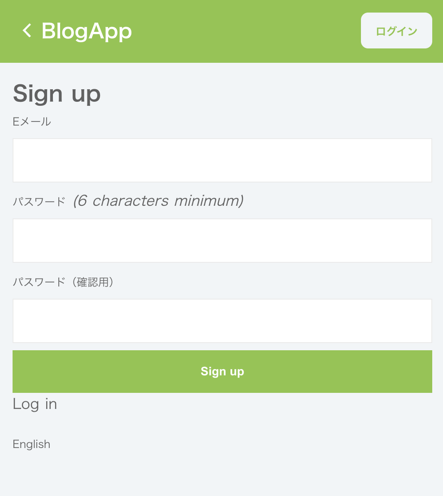
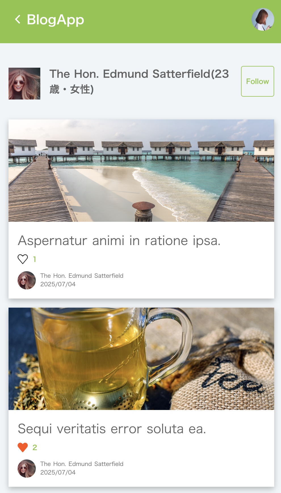

# README

## タイトル
シンプルなブログアプリです。
ユーザー登録・ログイン後に、記事の作成、編集、削除ができます。

## 主な機能
- ユーザー登録 / ログイン / ログアウト
- 記事のCRUD（作成・閲覧・編集・削除）
- 記事のお気に入り登録
- 記事へのコメント機能
- 記事への画像投稿機能（アイキャッチ）
- ユーザー間のフォロー機能

## 使用技術
- フロントエンド: ERB (Rails標準)
- バックエンド: Ruby on Rails
- データベース: SQLite3（ローカル開発）
- 認証: Devise

## 開発背景
このプロジェクトは初学者が学びながら進めているため、時間をかけてじっくり作っています。

## スクリーンショット

### メイン画面

  
  

  
  

### ログイン画面

  
  

### 投稿画面

  

### プロフィール画面

  
  

