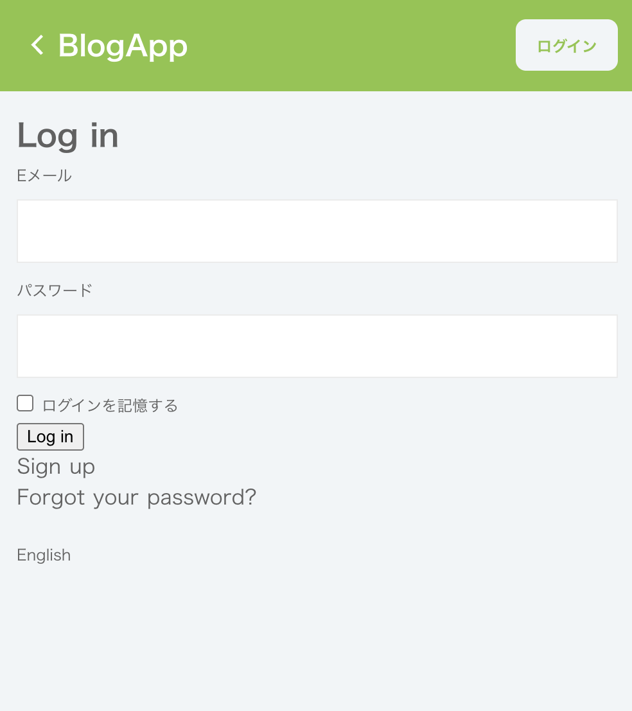
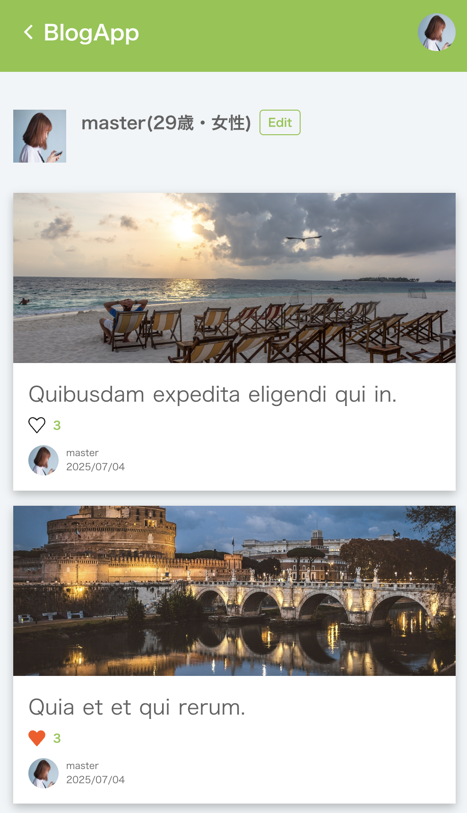

# README

## 現在開発中です。
2025年6月時点、ruby・railsのアップデートに伴うバグを修正中。

## タイトル
シンプルなブログアプリです。
ユーザー登録・ログイン後に、記事の作成、編集、削除ができます。

## 主な機能
- ユーザー登録 / ログイン / ログアウト
- 記事のCRUD（作成・閲覧・編集・削除）
- 記事のお気に入り登録
- 記事へのコメント機能
- 記事への画像投稿機能（アイキャッチ）
- ユーザー間のフォロー機能

## 使用技術
- フロントエンド:
- バックエンド:ruby
- データベース:

## 開発背景
このプロジェクトは初学者が学びながら進めているため、時間をかけてじっくり作っています。

## スクリーンショット

### メイン画面
記事を閲覧する画面です。

フォローしているユーザーの記事一覧が表示されます。

- 記事の全文を読めます。
- 「いいね」が出来ます。
- コメントを追加することが出来ます。

### ログイン、サインアップ画面
ユーザーがログイン、またはサインアップする画面です。

未登録のユーザーは新規登録が出来ます。

### 記事作成画面
新しい記事を投稿する画面です。

- アイキャッチが追加出来ます。
- 文字の装飾が出来ます。

### プロフィール画面
ユーザーのプロフィールや投稿記事を見る画面です。

プロフィールの編集やアイコンの変更ができます。

